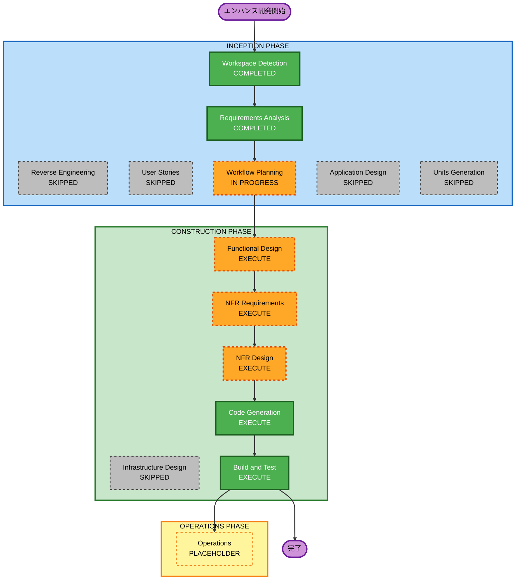

# 実行計画 — リソース一覧のキーワード検索・フィルタ追加

## 1. 詳細分析サマリー

### 変換スコープ（Brownfield）

- **変換タイプ**: Single Component Enhancement（既存コンポーネント境界内の拡張）
- **主要変更**: `GET /api/resources` への `keyword` パラメータ追加 + UI フィールド追加
- **影響コンポーネント**: ResourceController / ResourceService / ResourceRepository / ResourceFilterForm

### 変更影響評価

| 影響領域 | 有無 | 内容 |
|---|---|---|
| ユーザー向け変更 | Yes | キーワード入力フィールドが `/resources` に追加される |
| 構造変更 | No | 既存クラス・メソッドのシグネチャ拡張のみ |
| データモデル変更 | No | DB スキーマ変更なし（既存 `name`/`description` カラムを利用） |
| API 変更 | Yes | `GET /api/resources` に `keyword` クエリパラメータ追加（後方互換）|
| NFR 影響 | Yes | SECURITY-05（インジェクション防止）、PBT-09（jqwik フレームワーク）|

### コンポーネント関係

```
ResourceFilterForm.tsx (Frontend)
        |
        | keyword=... (URL param)
        v
ResourceController.java
        |
        | keyword
        v
ResourceService.java
    |               |
    | listPaginated | listWithAvailabilityFilter
    v               v
ResourceRepository.java   (Java Stream filter)
  (@Query JPQL ILIKE)
```

### リスク評価

- **リスクレベル**: Low
- **ロールバック複雑度**: Easy（keyword パラメータは optional、既存動作に影響なし）
- **テスト複雑度**: Moderate（PBT 追加あり）

---

## 2. ワークフロー可視化



### テキスト表現（代替）

```
INCEPTION PHASE:
  [x] Workspace Detection      — COMPLETED
  [x] Reverse Engineering      — SKIPPED（仕様書が RE 情報を提供済み）
  [x] Requirements Analysis    — COMPLETED
  [x] User Stories             — SKIPPED（単純拡張、受入条件は仕様書に記載）
  [ ] Workflow Planning        — IN PROGRESS (現在)
  [x] Application Design       — SKIPPED（既存コンポーネント境界内）
  [x] Units Generation         — SKIPPED（単一ユニット、分解不要）

CONSTRUCTION PHASE:
  [ ] Functional Design        — EXECUTE（PBT-01 プロパティ識別必須）
  [ ] NFR Requirements         — EXECUTE（SECURITY-05, PBT-09 フレームワーク選択）
  [ ] NFR Design               — EXECUTE（NFR Requirements が実行されるため）
  [x] Infrastructure Design    — SKIPPED（インフラ変更なし）
  [ ] Code Generation          — EXECUTE（必須）
  [ ] Build and Test           — EXECUTE（必須）

OPERATIONS PHASE:
  [ ] Operations               — PLACEHOLDER
```

---

## 3. 実行フェーズ詳細

### INCEPTION PHASE（完了）

- [x] **Workspace Detection** — 完了
- [x] **Reverse Engineering** — SKIPPED（エンハンス仕様書が文脈を提供）
- [x] **Requirements Analysis** — 完了（requirements.md 生成済み）
- [x] **User Stories** — SKIPPED（受入条件は仕様書に明記済み）
- [ ] **Workflow Planning** — 実行中（このドキュメント）
- [x] **Application Design** — SKIPPED: 既存クラス境界内の変更のみ。新規コンポーネント不要
- [x] **Units Generation** — SKIPPED: 単一ユニット（keyword 検索は 1 つの凝集した変更）

### CONSTRUCTION PHASE

- [ ] **Functional Design** — EXECUTE
  - **理由**: PBT-01 が Functional Design でのプロパティ識別を必須とする。`keyword` フィルタのビジネスルール（ILIKE、nullsafe、両パスへの適用方式）を設計する
- [ ] **NFR Requirements** — EXECUTE
  - **理由**: SECURITY-05（インジェクション防止）が必須チェック対象。PBT-09 が jqwik フレームワーク選択を要求する
- [ ] **NFR Design** — EXECUTE
  - **理由**: NFR Requirements が実行されるため必須。JPQL パラメータバインドの設計・jqwik 依存関係の追加
- [x] **Infrastructure Design** — SKIPPED: インフラ変更なし（クラウドリソース・デプロイ構成の変更なし）
- [ ] **Code Generation** — EXECUTE（必須）
  - Part 1: コード生成計画（チェックリスト）
  - Part 2: 実際のコード生成
- [ ] **Build and Test** — EXECUTE（必須）
  - ビルド手順 + ユニットテスト + インテグレーションテスト指示

### OPERATIONS PHASE

- [ ] **Operations** — PLACEHOLDER（将来の拡張）

---

## 4. パッケージ変更シーケンス

### バックエンド（backend/）

1. `ResourceRepository.java` — `@Query` メソッド追加（DB 依存、先行）
2. `ResourceService.java` — `list()` / `listPaginated()` / `listWithAvailabilityFilter()` 拡張
3. `ResourceController.java` — `keyword` パラメータ追加
4. `ResourceServiceTest.java` — keyword テスト + PBT 追加

### フロントエンド（frontend/）

1. `ResourceFilterForm.tsx` — `keyword` 入力フィールド + `handleSubmit` 更新
2. 親コンポーネント（`page.tsx`） — `searchParams.keyword` を Props に渡す

### 仕様書（Docs/spec/）

1. `api-spec.md` — `keyword` パラメータ追記
2. `screen-spec.md` — キーワード入力欄追記

---

## 5. 推定タイムライン

- **実行ステージ数**: 4（Functional Design, NFR Requirements, NFR Design, Code Generation, Build and Test）
- **推定所要**: 1セッション（コード量は小規模・影響範囲は明確）

---

## 6. 成功基準

- **主目標**: `keyword` クエリパラメータによる部分一致検索が動作すること
- **主要成果物**:
  - バックエンド: `keyword` 対応 Repository クエリ + Service ロジック + Controller エンドポイント
  - フロントエンド: キーワード入力フィールド付き `ResourceFilterForm`
  - テスト: `ResourceServiceTest` の既存テスト pass + keyword テスト + jqwik PBT
  - 仕様書: `api-spec.md` / `screen-spec.md` 更新
- **品質ゲート**:
  - 既存テストがすべて pass
  - SECURITY-05 準拠（JPQL パラメータバインド使用）
  - PBT-01〜10 準拠（jqwik による不変条件テスト）
