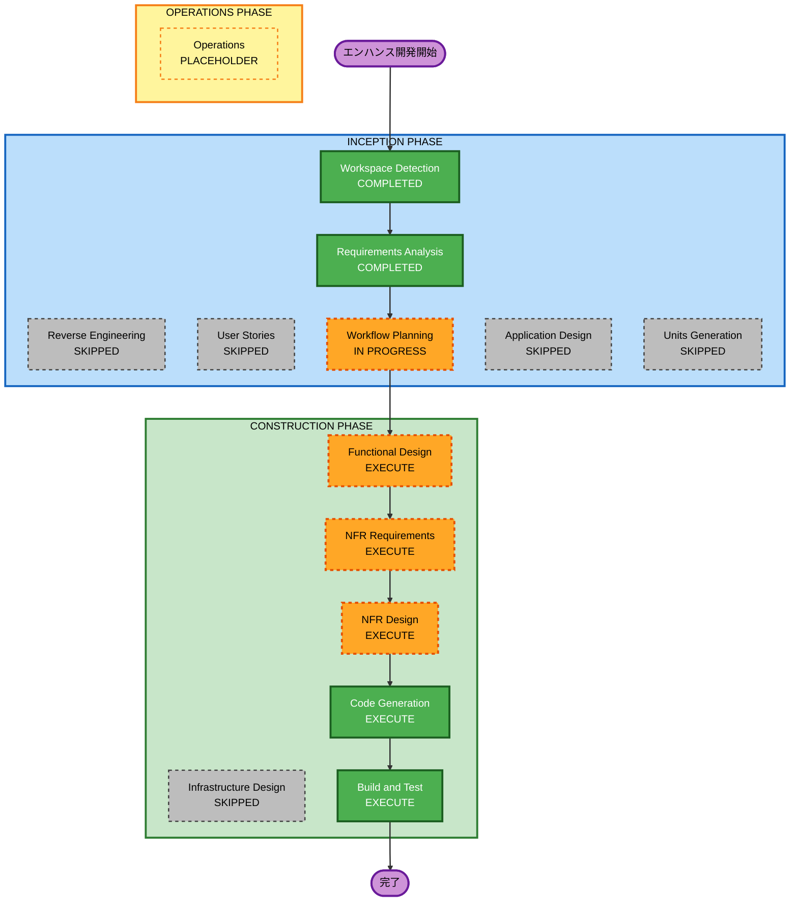

# 実行計画 — リソース一覧のソート順選択

## 1. 詳細分析サマリー

### 変換スコープ（Brownfield）

- **変換タイプ**: Single Component Enhancement（既存コンポーネント境界内の拡張）
- **主要変更**: `GET /api/resources` への `sort` パラメータ追加 + UI ソート選択肢追加
- **影響コンポーネント**: ResourceController / ResourceService / ResourceFilterForm / resources.ts

### 変更影響評価

| 影響領域 | 有無 | 内容 |
|---|---|---|
| ユーザー向け変更 | Yes | ソート選択 UI が `/resources` に追加される |
| 構造変更 | No | 既存クラス・メソッドのシグネチャ拡張のみ |
| データモデル変更 | No | DB スキーマ変更なし（既存カラムを利用） |
| API 変更 | Yes | `GET /api/resources` に `sort` クエリパラメータ追加（後方互換） |
| NFR 影響 | Yes | SECURITY-05（sort フィールド許可リスト）、PBT（Invariant・Idempotence） |

### コンポーネント関係

```
ResourceFilterForm.tsx (Frontend)
        |
        | sort=field,direction (URL param)
        v
resources.ts (Server Action)
        |
        | sort=field,direction
        v
ResourceController.java
        |
        | Pageable (with Sort) or sort param
        v
ResourceService.java
    |                         |
    | listPaginated            | listWithAvailabilityFilter
    | (from/to なし)            | (from/to あり)
    v                         v
ResourceRepository.java       Java Comparator
(Pageable に Sort 含む)      (fetchAllCandidates 後に適用)
```

### リスク評価

- **リスクレベル**: Low
- **ロールバック複雑度**: Easy（sort パラメータは optional、既存動作に影響なし）
- **テスト複雑度**: Moderate（PBT の Invariant / Idempotence 追加あり）

---

## 2. ワークフロー可視化



### テキスト表現（代替）

```
INCEPTION PHASE:
  [x] Workspace Detection      — COMPLETED
  [x] Reverse Engineering      — SKIPPED（仕様書が RE 情報を提供済み）
  [x] Requirements Analysis    — COMPLETED
  [x] User Stories             — SKIPPED（単純拡張・単一ユーザータイプ・受入条件は仕様書に明記済み）
  [ ] Workflow Planning        — IN PROGRESS (現在)
  [x] Application Design       — SKIPPED（既存コンポーネント境界内、新規コンポーネント不要）
  [x] Units Generation         — SKIPPED（単一ユニット、分解不要）

CONSTRUCTION PHASE:
  [ ] Functional Design        — EXECUTE（sort ロジック2分岐・PBT プロパティ識別必須）
  [ ] NFR Requirements         — EXECUTE（SECURITY-05、PBT Invariant/Idempotence）
  [ ] NFR Design               — EXECUTE（NFR Requirements が実行されるため）
  [x] Infrastructure Design    — SKIPPED（インフラ変更なし）
  [ ] Code Generation          — EXECUTE（必須）
  [ ] Build and Test           — EXECUTE（必須）

OPERATIONS PHASE:
  [ ] Operations               — PLACEHOLDER
```

---

## 3. 実行フェーズ詳細

### INCEPTION PHASE（完了）

- [x] **Workspace Detection** — 完了
- [x] **Reverse Engineering** — SKIPPED（エンハンス仕様書が文脈を提供）
- [x] **Requirements Analysis** — 完了（requirements.md 生成済み）
- [x] **User Stories** — SKIPPED
  - **理由**: 単純な既存機能拡張・単一ユーザータイプ・受入条件は requirements.md に明記済み。ストーリーが付加価値を生まない
- [ ] **Workflow Planning** — 実行中（このドキュメント）
- [x] **Application Design** — SKIPPED
  - **理由**: 変更はすべて既存クラス境界内。新規コンポーネント・新規メソッド定義は不要
- [x] **Units Generation** — SKIPPED
  - **理由**: sort 追加は単一の凝集した変更。多ユニット分解の必要なし

### CONSTRUCTION PHASE

- [ ] **Functional Design** — EXECUTE
  - **理由**: ソートロジックに2分岐（DB レベル vs Java レベル）あり。PBT-01 が Functional Design でのプロパティ識別を必須とする（Invariant: 要素数不変・順序関係、Idempotence: 同一 sort 2回適用）
- [ ] **NFR Requirements** — EXECUTE
  - **理由**: Security Baseline Full（SECURITY-05: sort フィールド許可リスト検証）・PBT Full（Invariant/Idempotence プロパティの実装）が有効
- [ ] **NFR Design** — EXECUTE
  - **理由**: NFR Requirements が実行されるため必須。sort フィールド許可リスト実装パターン・jqwik テスト構造の設計
- [x] **Infrastructure Design** — SKIPPED
  - **理由**: クラウドリソース・デプロイ構成の変更なし
- [ ] **Code Generation** — EXECUTE（必須）
  - Part 1: コード生成計画（チェックリスト付き手順）
  - Part 2: 実際のコード生成
- [ ] **Build and Test** — EXECUTE（必須）
  - ビルド手順 + ユニットテスト + インテグレーションテスト指示

### OPERATIONS PHASE

- [ ] **Operations** — PLACEHOLDER（将来の拡張）

---

## 4. パッケージ変更シーケンス

### バックエンド（backend/）

1. `ResourceController.java` — `sort` パラメータ受け取り（`Pageable` 拡張）
2. `ResourceService.java` — sort 2分岐（listPaginated: Pageable Sort / listWithAvailabilityFilter: Comparator）
3. `ResourceServiceTest.java` — ソートケース追加 + PBT（jqwik）追加

### フロントエンド（frontend/）

1. `resources.ts` — `sort` パラメータを API リクエストに追加
2. `ResourceFilterForm.tsx` — shadcn/ui `<Select>` でソート選択 UI 追加
3. `resources.test.ts` — sort 引き回しテスト追加

### 仕様書（Docs/spec/）

1. `api-spec.md` — `sort` パラメータ追記
2. `screen-spec.md` — ソート選択 UI 追記

---

## 5. 推定タイムライン

- **実行ステージ数**: 5（Functional Design, NFR Requirements, NFR Design, Code Generation, Build and Test）
- **推定所要**: 1セッション（コード量は小規模・影響範囲は明確）

---

## 6. 成功基準

- **主目標**: `sort=field,direction` クエリパラメータによるソート選択が動作すること
- **主要成果物**:
  - バックエンド: sort 対応 Service（2分岐）+ Controller エンドポイント
  - フロントエンド: shadcn/ui `<Select>` 付き `ResourceFilterForm`
  - テスト: `ResourceServiceTest` のソートケース pass + jqwik PBT（Invariant/Idempotence）
  - 仕様書: `api-spec.md` / `screen-spec.md` 更新
- **品質ゲート**:
  - 既存テストがすべて pass
  - SECURITY-05 準拠（sort フィールド許可リスト検証実装）
  - PBT Invariant・Idempotence プロパティが jqwik で検証済み
